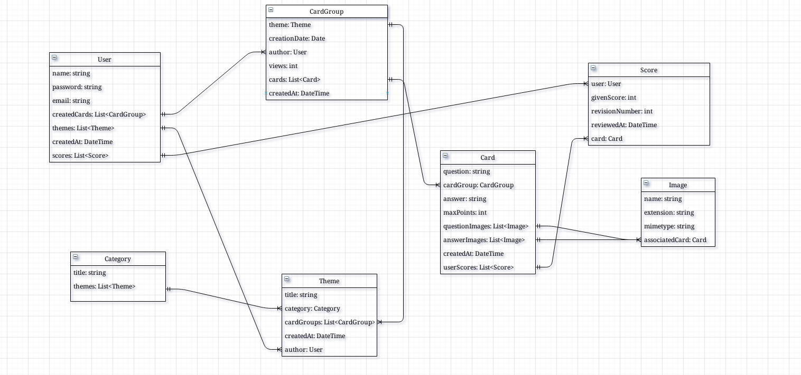

# K-A-M-K-K

This [Spring Boot](http://projects.spring.io/spring-boot/) application will help in your studies.
This is the backend side of a card learning project. We are using database ( PostgreSQL ) for saving your cards, card groups and
of course your scores. That means you can study anytime and anywhere you want.

If you want the best user experience use this application with our [Frontend](https://github.com/paramakk/K-A-M-K-K-frontend).

## Requirements

For building and running the application you need:

- [JDK 1.8](http://www.oracle.com/technetwork/java/javase/downloads/jdk8-downloads-2133151.html)
- [Maven 3](https://maven.apache.org)
- [PostgreSQL 42](https://www.postgresql.org/)

## Running the application locally

There are several ways to run a Spring Boot application on your local machine. One way is to execute the `main` method in the `projekt33.kamkk.KammkkBackendAppliaction` class from your IDE.

Alternatively you can use the [Spring Boot Maven plugin](https://docs.spring.io/spring-boot/docs/current/reference/html/build-tool-plugins-maven-plugin.html) like so:

```shell
mvn spring-boot:run
```


## UML
This [UML](https://hu.wikipedia.org/wiki/Unified_Modeling_Language) represent our entities and connections.

